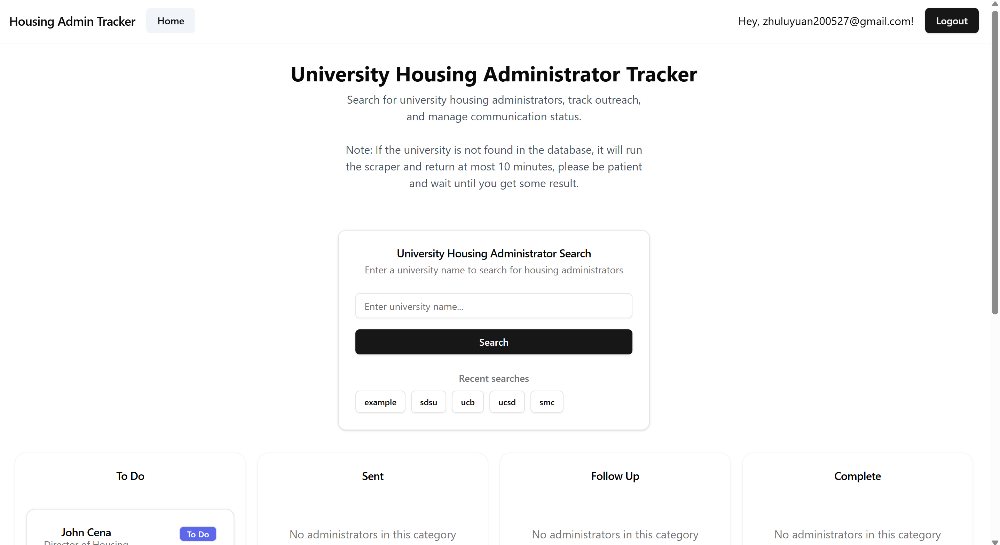

# University Housing Administrator Tracker

__Deployed On Vercel: https://university-housing-administrator-tr.vercel.app/__

This is a Next.js program that automatically discovers and tracks contact information for housing administrators at California universities, this is considered my personal project for Unishack. The script uses cheerio + axios web scraping to find staff directories, contact pages, and housing department information, then organizes the data for easy management and outreach.

## Technology/framework used: 

- Next.js 15.3.4 (React framework)
- TypeScript (Type-safe JavaScript)
- Supabase (Database & authentication)
- Tailwind CSS (Styling)
- shadcn/ui (UI components)
- Cheerio (HTML parsing/scraping)
- Axios (HTTP requests)
- Vercel (Deployment platform)
- Sonner (Toast notifications)

##Updates:
###V1.1 Update 8/4/2025: 
- Fixed dark mode UI problems, right now the texts should be readable.
- disabled searched and refined direction texts for the non-logged-in page. 
- Fixed email confirmation link invalid issue, it should now redirect to the login page.
-New Feature: Edit admin cards: Since people mentioned that some data is displayed in confusing ways, and it is impossible for the scraper to always be precise, nor did I want to clean up the data manually, now you can edit each admin card and save it to the database! 
